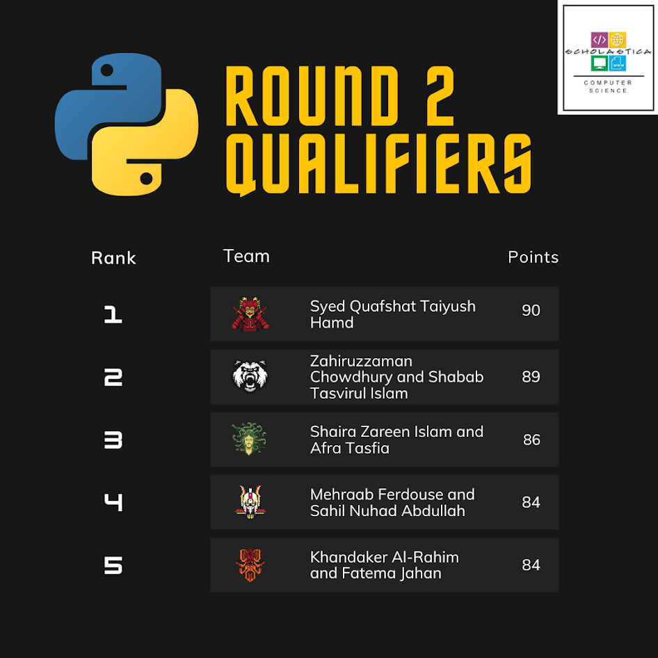
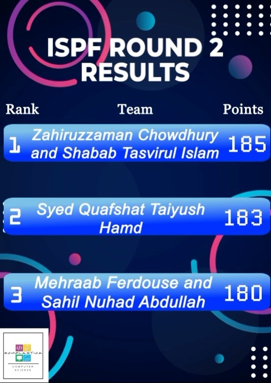
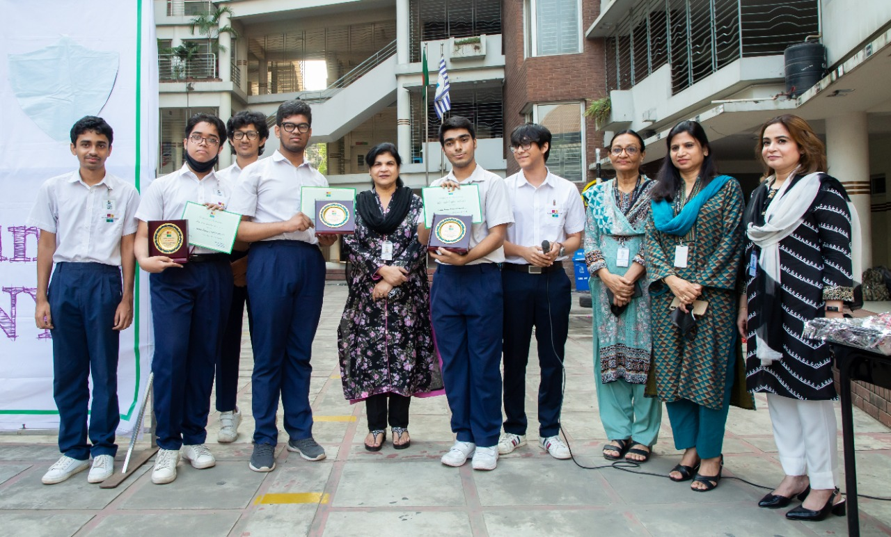

# Scholastica Python Festival 2022

## Summary

This was a 6-day coding competition (25th September to 30th September - officially it was supposed to end at 29th) consisting at least 25 groups (duo-teams and individuals), spanning to two rounds. Those who at least completed Round 1 assignment are entitled to a certificate of participation, but only the best five groups would ascend to round 2. Fortunately, we _did_ make it to the second round as _**second**_ :

> If only we didn't forget to submit the answer to the bonus, we would be at the top. All of this is `TheMayhem6328`'s fault ;-;
>
> Quafshat if you see this, please share your code to [my email](mailto:2013060031@scholastica.online) - I (TheMayhem6328 - Zahir) am genuinely interested in learning how you made it to the top.

Oh yeah right - **we won round 2** :D  

(We were the ones in the center - beside our principal)

Top three in Round 2 will get crests. Needless to say, we're aiming for the top :)

## Rounds

### Round 01 - [CRISIS](Round01/README.md)

> 25th September to 27th September || Time: 2.5 days

This round involved making a script that would take in ID numbers as inputs and make a random password and OTP code of each ID numbers. We had to validate almost everything. This was overall supposed to be an easy round, but due to improper collaboration and Taz2040 never using Git and GitHub before, this took some effort. More's documented in [its README](Round01/README.md).

### Round 02 - [Battle of The Champions](Round02/README.md)

> 29th September to 30th September || Time: 24 hours

The first round was to make code - this round revolved around debugging skills. We were given a buggy code which was supposed to decode / encode a string through [Caesar shift](https://www.wikiwand.com/en/Caesar_cipher). An interesting way to introduce masses to simpler cipher algorithms really - thanks Rayeed. Read more in the [Round's README](Round02/README.md).

## Team

### Zahiruzzaman Chowdhury - [TheMayhem6328](https://github.com/TheMayhem6328)

Took lead of how problems were solved. Did most of the code.

### Shabab Tasvirul Islam (Avro) - [Taz2040](https://github.com/Taz2040)

Did heavy testing. Occasionally helped with code efficiency and simpler code parts.

---
---

## Currently, [TheMayhem6328](https://github.com/TheMayhem6328) is working on a C++ port of the code (as a learning experience) - stay tuned for more :)
