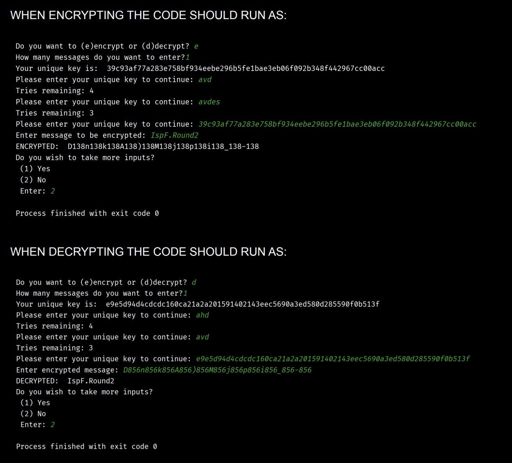

# Round 2 - Battle of The Champions

Debug the code: Attached in the `.py` file

## Instructions

- You cannot add any lines to the code
- You can remove a maximum of 3 lines (Optional)
- You may only edit the given lines
- You may edit the print statement to make the program more interactive
- Submit the code in a python file

## NOTE

You will not be marked on whether your entire code runs or not. Instead, you'll be marked on how many errors and **limitations** you fixed

## CODE EXPLAINED: Caesar Cipher Algorithm

1. It defines a procedure `cipher()` to takes and parameter which specifies the number of messages needed to be encrypted OR decrypted.

2. Before calling upon the procedure, a unique key is generated.
If the unique key matches with the key input, the user is allowed to enter the program.
The user has 5 tries to input the correct key.

3. If the correct key is entered, access is granted and the user can
input any string. The elements of the string are
converted to ascii values and the ascii values are incremented by
five. The character in the updated ascii value replaces
the original one. Knowledge of the functions `ord()` and `chr()` are
required, so search it up if needed.

4. The key is generated using the `secrets` library and the `hashlib`
library. The `secrets` library generates a random output
for which the `hashlib` converts the output to hexadecimal.

5. A random number is generated in the variable num, which is interpolated between every ENCRYPTED character.

6. The random number MUST NOT BE THERE in the decrypted string

## Code preview

