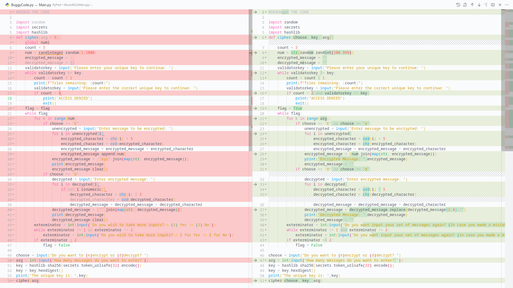

# Round 2 - [Battle of The Champions](README-Official.md)

We did a lot too much of work in this round in a short time to document it process-by-process in this README, but we can talk about some stuff regarding our debugging process. If you want to skip through the boring stuff and see what we changed, see this diff below:

## Challenge

We were given a buggy code that was supposed to encrypt / decrypt a string through Caesar shift and number interpolation. As aforementioned, the code was buggy. While it did partially run, it did not complete and definitely did not work as intended.

Seems simple, but what made it truly complicated was that:

- We had only 24 hours (from 5 pm GMT+6 on 29th September to 5 pm GMT+6 on 30th September)
- We were not allowed to add any line
- We were not allowed to remove more than three lines
- The code used libraries and functions we didn't fully understand (as of writing)
- We were very sleepy due to staying up late at night to solve Round 1
- We had to attend a birthday program on submission day (we were advised to go early)

Only the first four were real problems :)

## Tools and Knowledge

### IDE

We used [Visual Studio Code](https://code.visualstudio.com/) to do our code.

Sure, we could have used [PyCharm](https://www.jetbrains.com/pycharm/) too, but at least in our opinion, VSCode was far more than enough to get our job done. PyCharm is an industry-standard IDE dedicated to Python development - it's full of features meant to accelerate Python development, but was that necessary for this? At least I (TheMayhem6328) believe that PyCharm for this contest would be overkill. Functionality could be a hindrance too - there is quite a learning curve to PyCharm which, while rewarding to get over, interrupts workflow; interruption was something we could not afford to waste time for, considering the limited time we had. Besides, PyCharm is heavy on system resources too - VSCode tends to be significantly lighter than PyCharm.

Ultimately, it was just taste that made us go with VSCode - what works for you, works. (But not Python's IDLE - that's weak and just meant to do proper syntax highlighting and a bit of code completion.)

Visual Studio Code (and PyCharm too) dynamically reports syntax errors and useless variables (like variables that were initialized but never accessed). That helped us get rid of roughly more than half of our problem (half as in by count, not by severity 😛), which were syntax errors mostly, within a matter of minutes of starting to debug it.

### Breakpoints

The fact that breakpoints exist is a blessing in itself. Breakpoint-based debugging allows one to run the code line-by-line, step-by-step; for every step, you also get to see the state of variables in that step (information like what modules are loaded, what is the current value in a specific variable, etc). This method works way better than printing out specific variables randomly because this way of debugging helps catch even unexpected errors (as it shows almost everything in a neat way).

### Rigorous Testing

Nothing really beats mechanically going through all possible scenarios and being on the lookout for unexpected behaviors or outright unhandled exceptions (errors basically) and correcting problems as soon as you see one. While most commits to [this code](Main.py) was done by TheMayhem6328, Taz2040 did most of the testing and found out a handful of errors (handful is an understatement). Of course, TheMayhem6328 actually implemented the fixes, but Taz2040 finding out the errors was instrumental to developing a fix.
